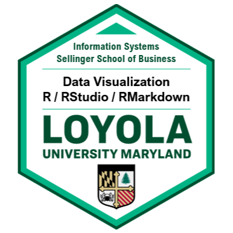
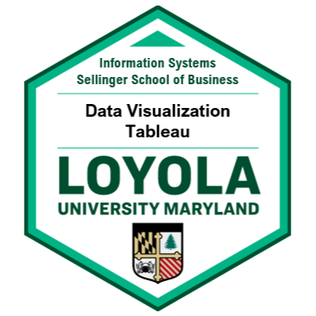

# Data Scientist

### Education
Data Science, M.S.

### Languages

| Python | R | SQL | SAS |
|--------|--------|--------|--------|
|  | | SQL | SAS |

### Work Experience 
Guy @ Impressive Company
- So many good, yes
- Very impressive, good job!
- Helpful

## Statistical Analysis
<a href="https://rpubs.com/Nolan_Clark">Rpubs</a>

## Tableau Dashboard Development
 <a href="https://public.tableau.com/app/profile/nolan.clark/vizzes">Public Tableau</a>

## 🏅 Microcredentials and Certifications

  
  
  
  
  
  

