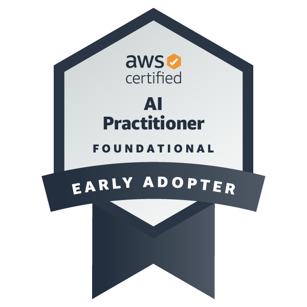

Welcome to my personal website! 

# About Me

🏡 I am a Data Scientist out of Annapolis, MD, and I transform raw data into insightful visualizations. I believe all data has a story to tell and I enjoy translating that message for audiences to better understand. 

🎓 My background in machine learning, natural language processing (NLP), and dashboard development was developed while earning my M.S. in Data Science. My continued journey into data science is sparked by an interest in Large Language Models (LLM) and the possibilities of Artificial Intelligence (AI) applications. 

🧠 Prior to my transition into data science, I held a career as a neurofeedback (NFB) clinician where I provided NFB therapy to alleviate symptoms of concussions, ADHD, anxiety, depression, and PTSD. This experience has given me a unique familiarity with both neural and muscular biometric data of electroencephalogram (EEG) and electromyography (EMG). 

## Contact
For business inquiries, collaborations, or if you would like to stay privy to future project updates, connect with me on LinkedIn!

## 🏅 Microcredentials and Certifications

  <a href="https://www.credly.com/badges/35777a96-428a-402a-b597-024697145386/public_url"/>
    
  <a href="https://www.credly.com/badges/174c76bb-eeb9-46e6-9b17-db78a7ad28a9/public_url"/>
        
  <a href="https://www.credly.com/badges/23ffda28-43da-46e1-805a-45921bc853ad/public_url"/>
    
  <a href="https://www.credly.com/badges/e756d768-2b66-4798-bdff-56fb3adf9b97/public_url"/>
    

  <a href="https://api.badgr.io/public/assertions/cBcL_EjlS8ejNJHTCBrbKA"/>
    

  <a href="https://api.badgr.io/public/assertions/Mo60voI8QpaLSmW4RLp48w"/>
    

  <a href="https://api.badgr.io/public/assertions/0DgTfgsDQp-_PwTj2dnNGA"/>
    

  <a href="https://api.badgr.io/public/assertions/suGn5YLtSg6u0uTlhEj9ng"/>
    

