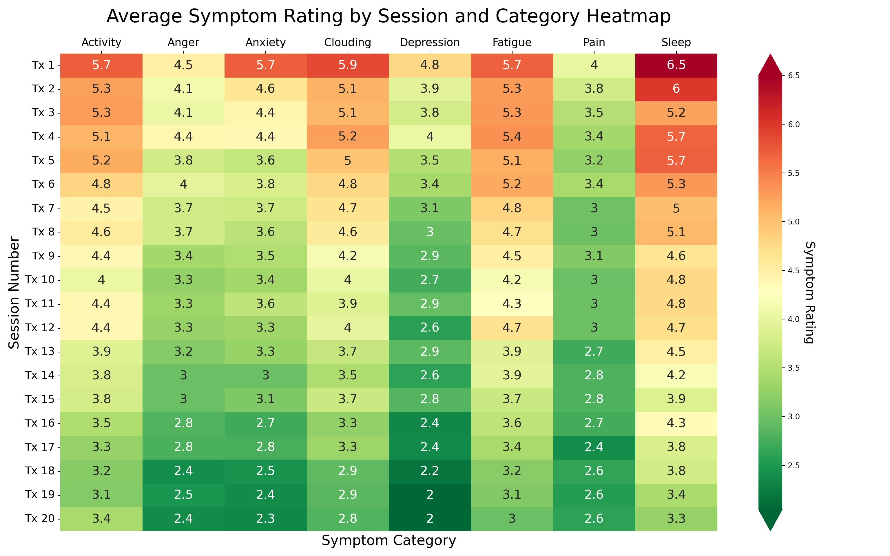

## Projects

  <h3>Automated Writing Evaluation System</h3>
  <a href="https://github.com/nolan-clark/Automated-Essay-Scoring-2.0"/>
    
 
Developed a deep learning solution for automatically grading essays by fine-tuning three pre-trained LLMs (Longformer, DeBERTa, and XLNet). Optimized performance through ensemble averaging, Optuna hyperparameter tuning, and GPU utilization. This project aims to streamline the grading process by providing consistent and accurate scores.

    
   <h3>Capstone: LLM Text Detector</h3>
  <a href="https://github.com/nolan-clark/Capstone"/>
    
 
Built an end-to-end pipeline for textual feature extraction of transformer-based embeddings, TF-IDF, and LIWC-22 in python. Investigated predictive strength of text-based features for detecting LLM-generated text compared to embeddings. Applied SHAP explanations to examine feature importance of model authorship classifications. Produced highly accurate and interpretable classifier for distinguishing 6th-12th grade student-written essays from LLM-generated text.

    
   <h3>Data Pipeline: Clash of Clans</h3>
  <a href="https://github.com/nolan-clark/Clash-of-Clans-CWL-ML"/>
    
  
Engineered a data pipeline from Supercell’s Clash of Clans NoSQL database using an API Key to generate 1 million rows of player clan performance data. The data was used to identify key performance indicators (KPIs) and develop machine learning models. Pipeline updates monthly to improve model accuracy and predictive strength.

  
   <h3>Neurofeedback Study Analysis</h3>
  <a href="https://rpubs.com/Nolan_Clark/1037116"/>
    
  
Provided descriptive and predictive analytics to be used for funding proposals. Solely handled the full data
process, from collection to report generation, to create a comprehensive report of previous Neurofeedback
therapy data.

    
   <h3>Organ Donor Rates by Organ Donor Policy</h3>
  <a href="https://rpubs.com/Nolan_Clark/1005469"/>
    
  
Modeled the organ donation rates of countries by organ donation policy and Legatum Prosperity Index measures
for predictive and prescriptive analysis. Modeling included stepwise linear regression and supervised machine
learning lasso regression.

    
  <h3>USA Airport Multi-Dashboard</h3>
   <a href="https://public.tableau.com/app/profile/nolan.clark/viz/Airports_Assignment/Dashboard1"/>
    
     
Created three interactive dashboards of all United States airports to provide users with a tool for descriptive
analysis. The project can also be used as prescriptive analytic tool for choosing potential flight destinations.

   <h3>Washington, D.C. Airbnb Interactive Report</h3>
  <a href="https://rpubs.com/Nolan_Clark/885963"/>
    
  
Conducted descriptive and prescriptive analysis on the Airbnb data of Washington, D.C. to determine best
listings, locations, and times to book with Airbnb in the area. The report includes 6 graphs, a choropleth map, and
a dot density map.

    
   <h3>Seattle Police Department Call Analysis</h3>
   <a href="https://rpubs.com/Nolan_Clark/870953"/>
    
     
Conducted descriptive analysis on the Seattle Police Department Call Data (4.84 million rows) to assess the
historical efficiency at police call response.

     
   <h3>Capital Bikeshare Dashboard</h3>
   <a href="https://public.tableau.com/app/profile/nolan.clark/viz/BikeSharingVisualization_16407343099230/Dashboard1"/>
    
     
Created dashboard of descriptive analytics for the activity of Capital Bikeshare users in Washington, D.C. from
2011-2012. Intent was to find notable relationships between weather conditions and consumer engagement.

     
   <h3>Olympic Medal Dashboard</h3>
   <a href="https://public.tableau.com/app/profile/nolan.clark/viz/120yearsUSAOlympicHistory/Dashboard1"/>
    
     
Created an interactive dashboard breaking down the success the United States has seen in the Olympics from
Athens 1896- Rio 2016. Intended to gain insight on the events and athletes responsible for the USA dominance in
the Olympics.

